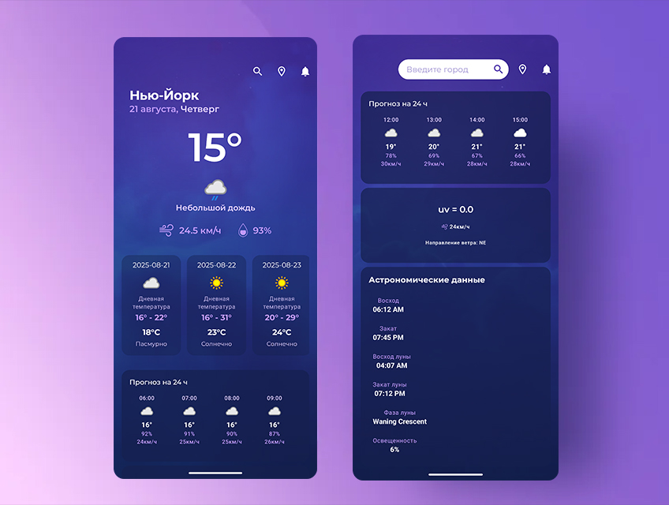

# AppWeather

Простое Android-приложение для просмотра текущей погоды и прогноза с использованием [WeatherAPI.com](https://www.weatherapi.com/).

## Скриншоты



## Демо


## Возможности

- 🌤️ Погода в реальном времени для любого города
- 📅 Прогноз погоды на 3 дней
- 🌡️ Температура в градусах Цельсия/Фаренгейта
- 📍 Погода по геолокации (с использованием GPS)
- 🎨 Простой и интуитивный интерфейс

## Требования

- Android 8.0 (Oreo) или выше
- Подключение к интернету для запросов к API

## Установка

1. Клонируйте репозиторий:
   ```bash
   git clone https://github.com/M-Vadim-dev/AppWeather.git
   ```
2. Откройте проект в Android Studio.
3. Добавьте ключ Weather API:
   - Добавьте в local.properties: `API_KEY=your_api_key_here`
4. Синхронизируйте проект с Gradle: **File** → **Sync Project with Gradle Files**.
5. Соберите и запустите приложение на эмуляторе или устройстве.

## Использование

1. Откройте приложение и разрешите доступ к геолокации (опционально).
2. Введите название города в строке поиска, чтобы увидеть текущую погоду.
3. Перейдите на вкладку прогноза для просмотра погоды на 3 дней.
4. Переключите между Цельсием и Фаренгейтом в настройках.

## Технологии

- **Язык**: Kotlin
- **API**: Weather API
- **Библиотеки**: Retrofit (для API-запросов), Coil (для загрузки изображений)
- **Архитектура**: MVVM
- **Инструмент сборки**: Gradle
